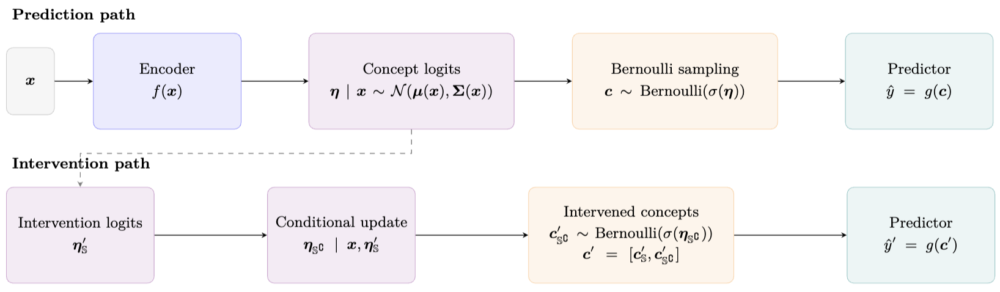
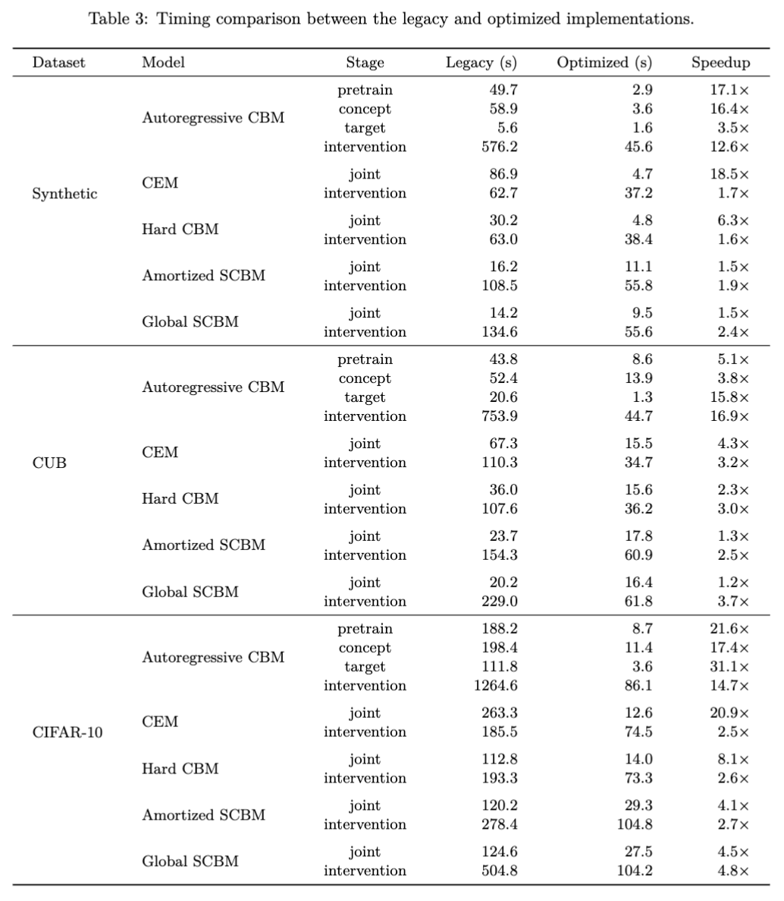
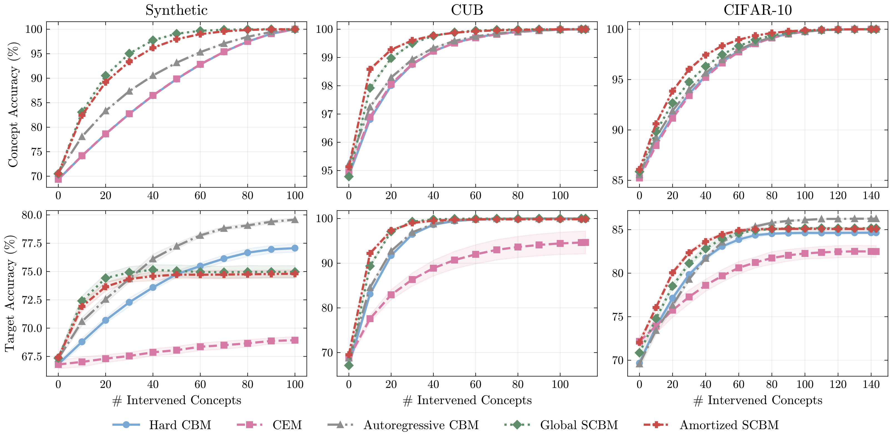
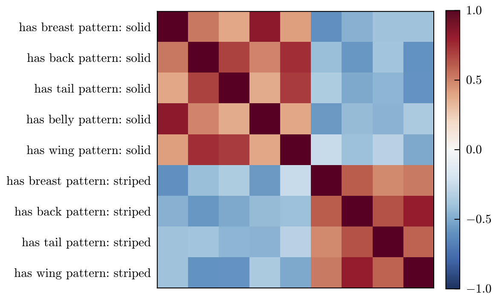

# Stochastic Concept Bottleneck Models

This repository is a refactored and optimized version of the Stochastic Concept
Bottleneck Models codebase. For the original paper, citation, and upstream
implementation details, see: [SCBM](https://github.com/mvandenhi/SCBM)

## Highlights

### Model Architecture Overview


### Speedup Comparison


### Intervention Curves


### Learned concept covariances



## Instructions

### Environment

Create a clean conda environment, install PyTorch for your platform, then install
the remaining Python dependencies with pip:

```bash
conda create -n scbm python=3.12 -y
conda activate scbm

# Install PyTorch/torchvision from the official selector for your CUDA/CPU setup:
# https://pytorch.org/get-started/locally/
# Example: pip install torch torchvision --index-url <official-pytorch-index-url>

pip install numpy scipy pillow wandb scikit-learn tqdm torchmetrics matplotlib hydra-core omegaconf plotly seaborn transformers pytorch-minimize
```

### Dataset Setup

The repository supports CUB, CIFAR-10/100, and synthetic experiments. By default,
datasets are expected under `./data/`, as configured by `data_path` in
`./configs/data/data_defaults.yaml`. To use another location, pass
`data.data_path=/path/to/data/` when running `train.py`.

Organize the local datasets as follows:

```text
SCBM/
`-- data/
    |-- CUB/
    |   |-- CUB_200_2011/
    |   |   |-- concept_names.txt
    |   |   `-- images/
    |   `-- CUB_processed/
    `-- cifar10/
```

For CUB, download the original CUB_200_2011 dataset, the `CUB_processed` data
used by Concept Bottleneck Models, and `concept_names.txt`.

For CIFAR-10 and CIFAR-100, create the local dataset files with:

```bash
python ./datasets/create_dataset_cifar.py
```

The synthetic dataset is generated by the dataset code and does not require a
manual download.

### Training

Run `train.py` with a dataset config and a model config from `./configs/`. For
example:

```bash
python -u train.py +model=SCBM +data=synthetic
```

Weights & Biases logging is disabled by default. To enable it, set
`logging.mode=online` and update `logging.entity` in `./configs/config.yaml`, or
override them from the command line.

To switch between SCBM variants, set `model.cov_type` and
`model.reg_precision`. The experiment scripts use:

- amortized SCBM: `model.cov_type=amortized model.reg_precision=l1`
- global SCBM: `model.cov_type=global model.reg_precision=None`

## Running Experiments

The `./scripts/` directory contains entry points for reproducing the experiments.

For local runs, use the dataset-specific scripts:

```bash
bash ./scripts/run_synthetic.sh
bash ./scripts/run_cifar10.sh
bash ./scripts/run_CUB.sh
```

These scripts run CBM, CEM, AR, and both SCBM variants across the seeds used in
the experiments.

## Useful Scripts

- `./scripts/run_speed_benchmark.sh`: runs short training benchmarks across
  datasets and models.
- `./scripts/run_intervention_benchmark.sh`: measures intervention runtime
  across datasets and models.
- `./scripts/verify_conf_interval_real_batch.py`: compares the original
  confidence-interval intervention solver with the batched GPU solver on a real
  SCBM batch.
